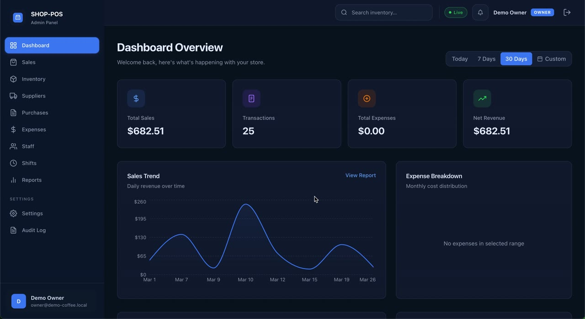
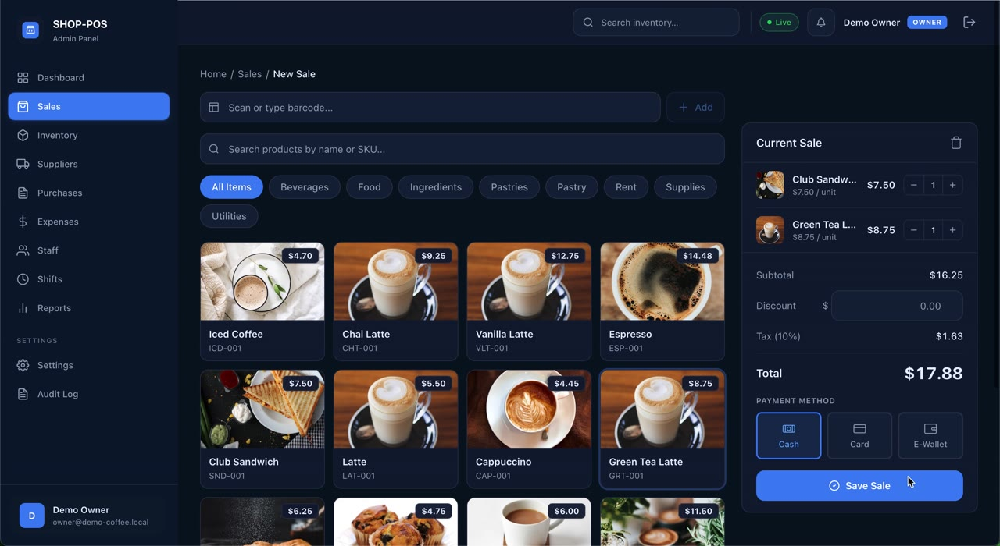
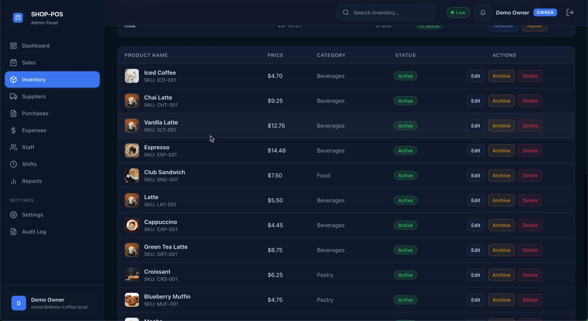
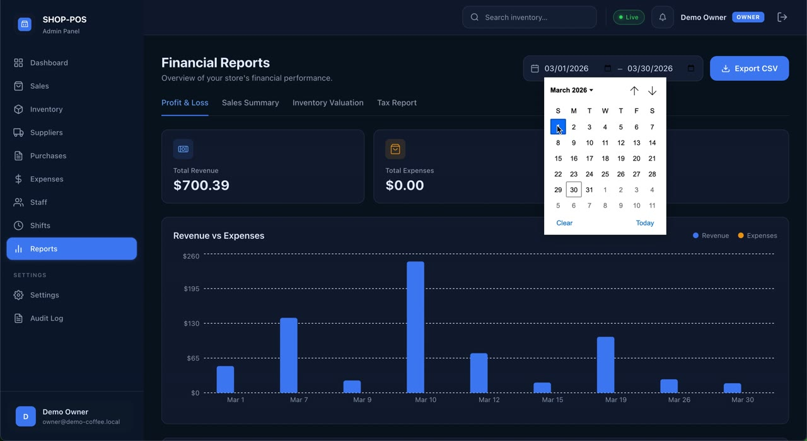
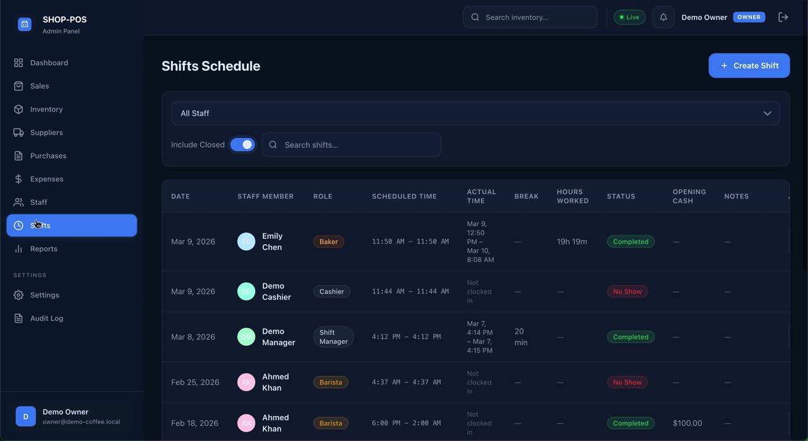
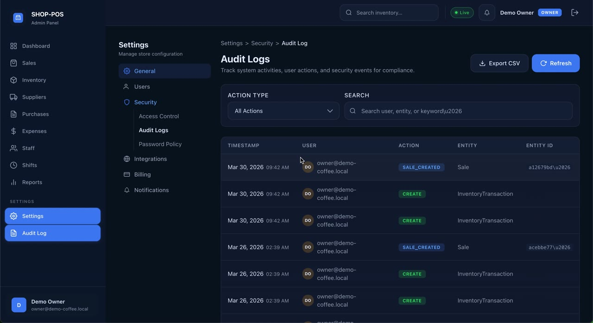
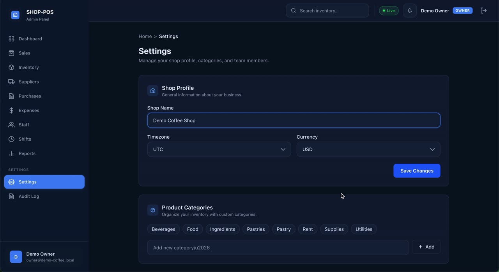

<div align="center">


# 🏪 ShopPOS

### *The complete multi-tenant POS & shop management SaaS — ready to fork, brand, and ship.*

<br/>

**A production-grade Point of Sale system built for cafes, retail stores, and multi-location businesses.**
**Multi-tenant architecture means one deployment serves unlimited shops** — perfect for SaaS founders who want to launch in days, not months.

<br/>

[](https://shop-pos-sand.vercel.app/)
[](https://www.aibuddy.design)
[](https://www.aibuddy.design)

<br/>

**Built with** &nbsp;·&nbsp;


</div>

---

## 🎯 Who This Is Built For

> **A complete, battle-tested SaaS codebase — skip 6+ months of building auth, multi-tenancy, billing, RBAC, and reporting from scratch.**

<table>
<tr>
<td width="33%" align="center">
<h3>🚀</h3>
<b>SaaS Founders</b><br/><br/>
<sub>Launch your own POS SaaS in days. White-label, brand it, charge customers, scale.</sub>
</td>
<td width="33%" align="center">
<h3>🏢</h3>
<b>Agencies</b><br/><br/>
<sub>Resell to multiple shop clients. One codebase, unlimited deployments.</sub>
</td>
<td width="33%" align="center">
<h3>🛍️</h3>
<b>Shop Owners</b><br/><br/>
<sub>Run your cafe / retail business with a modern, fast POS — minus the monthly SaaS fees.</sub>
</td>
</tr>
</table>

---

## ✨ Try It Live — Right Now

<div align="center">

### 👇 Click below for a live, fully-functional demo

<br/>

[](https://shop-pos-sand.vercel.app/)

<br/>

**Two seeded demo tenants** — explore retail and coffee shop variants
**Full POS flow** — add to cart, payment, receipts
**Live realtime updates** — watch the dashboard tick in real time

</div>

---

## 🖼️ Inside the Product

> _Drop your screenshots in `/screenshots` folder and replace these paths. Naming guide below._

### 🎯 Modern, dark-themed dashboard with realtime KPIs


> Total sales, transactions, expenses, net revenue — with a sales trend chart and expense breakdown. Switch between **Today / 7 Days / 30 Days / Custom** range. The green **● Live** badge means the SSE stream is connected.

<br/>

### 🛒 POS — built for speed, not just for show


> Barcode scan, name/SKU search, category filter chips, and a beautiful product grid with images. Cart on the right with quantity stepper, auto-tax (10%), discount, and payment method selector — **Cash, Card, E-Wallet**. Atomic stock deduction means you cannot oversell.

<br/>

### 📦 Inventory that actually scales


> SKU, image, price, category, stock status. One-click **Edit / Archive / Delete**. Restock and adjust workflows built-in. Low-stock alerts trigger realtime notifications + sound.

<br/>

### 📊 Financial reports your accountant will love


> **Profit & Loss · Sales Summary · Inventory Valuation · Tax Report** tabs. Custom date range with calendar picker. **Export CSV** for QuickBooks or any accounting system. Daily revenue vs expenses bar chart.

<br/>

### 👥 Staff, shifts, and role-based access


> Schedule shifts, track scheduled vs actual time, opening cash, hours worked, status (Completed / No Show), break duration, notes. Add team members with **Cashier / Manager** access levels and granular permissions.

<br/>

### 🛡️ Audit logs for compliance


> Every write operation tracked — `SALE_CREATED`, `CREATE`, `UPDATE`, `DELETE` with timestamp, user, entity, and entity ID. Filter by action type, search by user/entity. **Export CSV** for compliance audits.

<br/>

### ⚙️ Settings — multi-currency, multi-timezone, fully customizable


> Shop profile, timezone, currency (USD · EUR · GBP · PKR · AED · SAR · and more), product categories, team members with role tags, notifications, data retention, JSON/CSV export, archival policy.

---

## 🧩 Feature Set

<details open>
<summary><b>🏢 Multi-Tenant SaaS Architecture</b></summary>

- **Data isolation by `tenantId`** — deploy once, serve unlimited shops
- **Platform admin panel** — create tenants, hand-over to buyers
- **Role-based access control** — Owner · Manager · Staff
- **Tenant-scoped permissions** at every API endpoint

</details>

<details>
<summary><b>🛒 Point of Sale</b></summary>

- Barcode scanning + SKU/name search
- Category filter chips, paginated product grid
- Cart with discount, configurable tax %, multiple payment methods (Cash · Card · E-Wallet)
- **Atomic stock deduction** — never oversells
- Receipt generation
- Endpoint: `GET /api/products/lookup?barcode=...`

</details>

<details>
<summary><b>📦 Inventory Management</b></summary>

- Products, categories, stock levels, restock workflows
- Low-stock alerts with realtime notifications + sound
- Stock movements & adjustment history
- Cost price tracking + margin visibility
- Bulk operations support

</details>

<details>
<summary><b>🚚 Suppliers & Purchases</b></summary>

- Full supplier CRUD with contact, code, status
- Link products to suppliers
- Record purchases with cost, quantity, supplier reference
- Inventory valuation reporting based on cost prices

</details>

<details>
<summary><b>💰 Expenses & Accounting</b></summary>

- Categorized expense tracking
- **QuickBooks CSV export** + generic CSV
- Tax reports with configurable rates
- Daily revenue vs expense charts
- Expenses by category breakdown

</details>

<details>
<summary><b>👥 Staff & Shifts</b></summary>

- Staff CRUD with role tags (Barista · Cashier · Shift Manager · Baker · custom)
- Shift scheduling with check-in/check-out
- Hours-worked, break, opening cash tracking
- Status flags (Completed · No Show · In Progress)

</details>

<details>
<summary><b>📊 Reports & Analytics</b></summary>

- Financial summary, top products, low stock
- Daily revenue, expenses by category, tax report, inventory valuation
- Custom date range pickers
- CSV export on every report

</details>

<details>
<summary><b>🔌 Integrations & Webhooks</b></summary>

- **Outbound webhooks** — sale, purchase, inventory, expense events
- Test webhook delivery from UI
- QuickBooks CSV + generic accounting CSV exports

</details>

<details>
<summary><b>⚡ Realtime Updates</b></summary>

- **Server-Sent Events (SSE)** — live dashboard, sales, inventory, purchases, expenses, shifts
- Smart fallback: 30s polling when SSE disconnects, polling auto-disabled when SSE reconnects
- Notification bell with sound + popup for low-stock alerts
- Visible `● Live` indicator in topbar

</details>

<details>
<summary><b>🔒 Security & Reliability</b></summary>

- Cookie-based session auth, **bcrypt password hashing**
- HMAC-signed session tokens (32-byte secret)
- Forgot/reset password (Resend integration optional)
- **Audit logging** on every write operation
- Health check: `GET /api/health`
- Consistent error format: `{ error, code, details? }`
- Paginated list endpoints: `{ data, meta }`
- Zod validation on every input
- Data retention + archival policy

</details>

---

## 🛠️ Tech Stack

<table>
<tr>
  <td><b>Framework</b></td>
  <td>Next.js 16 (App Router + API Routes)</td>
</tr>
<tr>
  <td><b>Language</b></td>
  <td>TypeScript 5</td>
</tr>
<tr>
  <td><b>Database</b></td>
  <td>PostgreSQL — Neon Serverless (or self-hosted)</td>
</tr>
<tr>
  <td><b>ORM</b></td>
  <td>Prisma 7</td>
</tr>
<tr>
  <td><b>Validation</b></td>
  <td>Zod 4</td>
</tr>
<tr>
  <td><b>Auth</b></td>
  <td>Cookie sessions + bcrypt + HMAC tokens</td>
</tr>
<tr>
  <td><b>Realtime</b></td>
  <td>Server-Sent Events (SSE) with polling fallback</td>
</tr>
<tr>
  <td><b>Email</b></td>
  <td>Resend (optional, for password reset)</td>
</tr>
<tr>
  <td><b>Image Storage</b></td>
  <td>Cloudflare R2 (optional, for product photos)</td>
</tr>
<tr>
  <td><b>Deployment</b></td>
  <td>Vercel (recommended) or self-hosted Docker</td>
</tr>
</table>

---

## 🏗️ Architecture

```
┌───────────────────────────────────────────────────────┐
│                Platform Admin Panel                   │
│             (manages all tenants/shops)               │
└────────────────────┬──────────────────────────────────┘
                     │
       ┌─────────────┼─────────────┐
       ▼             ▼             ▼
  ┌────────┐    ┌────────┐    ┌────────┐
  │Tenant 1│    │Tenant 2│    │Tenant N│
  │ Cafe   │    │ Retail │    │  ...   │
  └────┬───┘    └────┬───┘    └────┬───┘
       │             │             │
       └─────────────┼─────────────┘
                     ▼
        ┌─────────────────────────┐
        │   PostgreSQL (Neon)     │
        │   tenantId-isolated     │
        │   atomic transactions   │
        └─────────────────────────┘
```

- **Single codebase, infinite tenants** — true SaaS architecture
- **Stateless API design** — scales horizontally
- **Atomic transactions** for stock deduction and sale recording
- **SSE-based realtime** with smart polling fallback

---

## 📦 What You Get When You License It

<table>
<tr><td>✅</td><td><b>Full TypeScript source code</b> — clean, typed, well-organized</td></tr>
<tr><td>✅</td><td><b>Database schema + migrations</b> (Prisma)</td></tr>
<tr><td>✅</td><td><b>Demo data seeders</b> — retail + coffee shop tenants</td></tr>
<tr><td>✅</td><td><b>Architecture documentation</b> with diagrams</td></tr>
<tr><td>✅</td><td><b>Full API reference</b> — every endpoint with curl examples</td></tr>
<tr><td>✅</td><td><b>Production deployment guide</b> — Vercel + Docker</td></tr>
<tr><td>✅</td><td><b>Buyer handover walkthrough</b> — one-time setup</td></tr>
<tr><td>✅</td><td><b>Testing checklist</b> for QA</td></tr>
<tr><td>✅</td><td><b>Email setup</b> (Resend) — plug-and-play</td></tr>
<tr><td>✅</td><td><b>Lifetime use</b> — one-time purchase, no recurring fees</td></tr>
</table>

---

## 💰 Licensing Tiers

> **License:** Proprietary. All rights reserved.
> Source code is **not** publicly available. This is a commercial product.

<table>
<tr>
<th width="33%">🥉 Solo License</th>
<th width="33%">🥈 Reseller License</th>
<th width="33%">🥇 White-Label SaaS</th>
</tr>
<tr>
<td valign="top">

For one business / one deployment.

- Run your own shop
- Single tenant deployment
- Modify for personal use
- All source code & docs

</td>
<td valign="top">

For agencies & freelancers.

- Deploy for unlimited clients
- Multi-tenant deployments
- Customize per client
- All source code & docs
- Priority email support

</td>
<td valign="top">

For SaaS founders.

- Full rights to brand
- Modify and resell as your own
- Charge your own customers
- All source code & docs
- Priority email support
- Custom feature consultation

</td>
</tr>
</table>

> 💡 **Need help launching?** Custom development, branding, deployment, and feature additions available — quoted per scope.

---

## 📩 Buy / License / Hire Me

<div align="center">

### Ready to launch your own POS SaaS?

[](https://www.aibuddy.design)

<br/>

**👉 [www.aibuddy.design](https://www.aibuddy.design) — contact form**

<br/>

When you reach out, please include:

`1. Which license tier interests you (Solo / Reseller / White-Label)`
`2. Your use case (own shop · agency · SaaS founder)`
`3. Any custom requirements or questions`

<br/>

**📨 You'll hear back within 24 hours.**

</div>

---

## 🙋 Frequently Asked

<details>
<summary><b>Is the source code included when I buy?</b></summary>

<br/>Yes — full TypeScript source code, complete database schema, all migrations, demo data seeders, and full documentation. You own a complete, deployable codebase.

</details>

<details>
<summary><b>Can I modify the code?</b></summary>

<br/>Yes — depending on your license tier:

- **Solo** — modify for your own deployment
- **Reseller** — modify for client deployments
- **White-Label** — full modification, branding, and resale rights

</details>

<details>
<summary><b>Do you offer setup, deployment, or customization services?</b></summary>

<br/>Yes — I can deploy it for you, customize the branding, build new features, or integrate with your existing systems. Quoted separately based on scope.

</details>

<details>
<summary><b>Will I get updates?</b></summary>

<br/>Update access is discussed per-tier at purchase. Bug fixes and security patches are typically included for a defined window.

</details>

<details>
<summary><b>Why isn't the code public on GitHub?</b></summary>

<br/>ShopPOS is a commercial product. Public source would devalue it for paying customers. The **live demo + this showcase** let you fully evaluate the product. Full source is delivered on purchase.

</details>

<details>
<summary><b>Can I see the code before buying?</b></summary>

<br/>For serious buyers — yes. I can arrange a private code review under NDA, or schedule a guided walkthrough call.

</details>

<details>
<summary><b>What's included in the live demo?</b></summary>

<br/>Two seeded tenants (retail + coffee shop) with realistic data — products, sales, staff, shifts, expenses. You can explore every screen and try the full POS flow.

</details>

<details>
<summary><b>Can it handle my specific business type?</b></summary>

<br/>ShopPOS is built for cafes, retail, and small shops out of the box. The architecture is generic enough to be adapted to bakeries, salons, electronics stores, mini-marts, and similar businesses with minor customization.

</details>

---

## 👨‍💻 About the Developer

<table>
<tr>
<td width="100">
<a href="https://github.com/svhPeter"></a>
</td>
<td>

**Sami** — full-stack, mobile, and AI developer based in Karachi, Pakistan 🇵🇰

I build production-grade web, mobile, and AI products. ShopPOS is one of several products I've built and ship. Open for freelance work — custom development, integrations, and SaaS builds.

🌐 **Portfolio:** [aibuddy.design](https://www.aibuddy.design)
💻 **GitHub:** [@svhPeter](https://github.com/svhPeter)
💼 **Hire me** for custom builds — web, mobile, AI products

</td>
</tr>
</table>

---

<div align="center">

### ⭐ Star this repo to help other founders discover it

<br/>

<sub>Built with ❤️ in Karachi · ShopPOS © 2026 · All rights reserved</sub>

</div>
